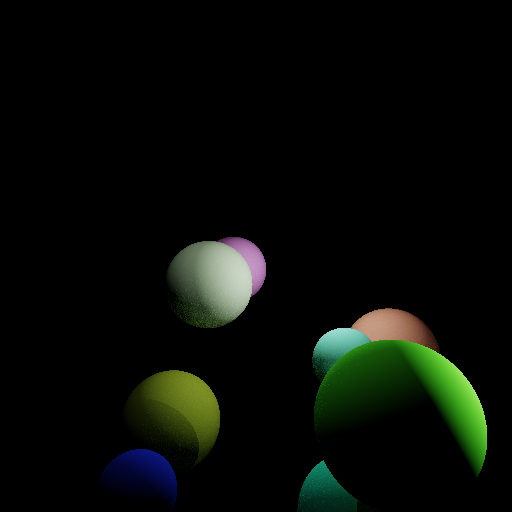

# Overview

This is a raytracer built in TypeScript. It generates bitmap images of 3D scenes composed of simple spheres. Based on the physically-based lighting model described on [learnopengl.com](https://learnopengl.com/PBR/Theory).

The goal of this project is to teach me TypeScript! I've found that building a raytracer is a great way to learn new programming languages, as it introduces you to the standard library, gives you plenty of time to absorb the syntax, and teaches you a lot of idioms along the way. Plus at the end, you have some cool bitmaps to show for your efforts!

# Development Environment

I'll be building this project in VS Code and using Git Bash as my terminal.

I'll be using TypeScript and Node.js for this project.

# Useful Websites

- [TypeScript](https://www.typescriptlang.org/docs/)
- [W3Schools](https://www.w3schools.com/typescript/index.php)
- [MDN](https://developer.mozilla.org/en-US/docs/Glossary/TypeScript)
- [TypeScript Docs](https://typescriptdocs.com/)

# Future Work

- **More geometric primitives**: Currently, the raytracer only supports spheres. Adding support for convex polyhedra, triangle meshes, or even solids defined by signed distance functions would allow for more complex scenes.
- **Full PBR materials**: The current material has a single albedo parameter. At a minimum, I'd like to add roughness and metallicity, although since this is a raytracer, adding transparency and refraction are natural places to go.
- **Extended scene functionality**: Right now, the camera is fixed at the origin looking down the -Z axis, and lights are always white. I'd like to add colored lights, arbitrary camera transforms, custom camera projections, rotations for objects, maybe animation!
